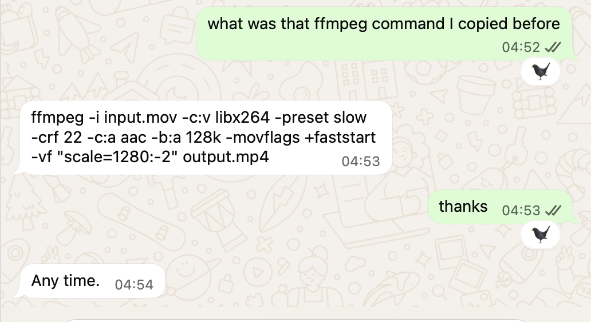
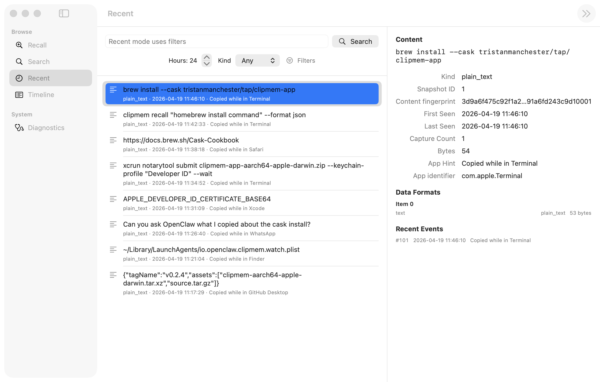
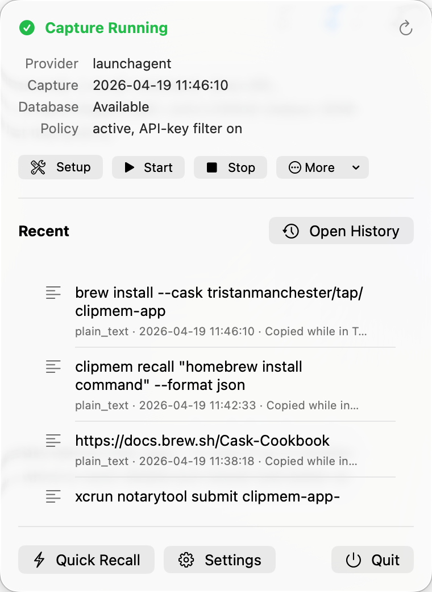

# clipmem

[](https://crates.io/crates/clipmem)
[](LICENSE)
[](https://www.rust-lang.org)

<p align="center">
  
</p>

<p align="center">
  
</p>

<p align="center">
  
</p>

A searchable, local-only clipboard history for macOS, with a JSON-first CLI designed so agents — OpenClaw and others — can recall things you've copied.

`clipmem` watches the macOS system clipboard (`NSPasteboard`), archives every observed state into a local SQLite database, and exposes retrieval, restore, deletion, and policy commands (`recall`, `recent`, `timeline`, `search`, `get`, `restore`, `export`, `forget`, `purge`, `settings`) that return either human-readable text or structured JSON.

## Contents

- [Requirements](#requirements)
- [Install](#install)
- [Quick start](#quick-start)
- [Run in the background (LaunchAgent)](#run-in-the-background-launchagent)
- [Recalling and searching](#recalling-and-searching)
- [Restore, Deletion, and Policy](#restore-deletion-and-policy)
- [Output formats](#output-formats)
- [Using with OpenClaw](#using-with-openclaw)
- [Privacy](#privacy)
- [Uninstall / Full cleanup](#uninstall--full-cleanup)
- [Limitations](#limitations)
- [How it works](#how-it-works)
- [Native macOS menu bar app](#native-macos-menu-bar-app)
- [Development](#development)
- [License](#license)

## Requirements

- **macOS.** Clipboard capture uses `NSPasteboard` via `objc2` / `objc2-app-kit` and is gated behind `cfg(target_os = "macos")`. The database and search layers compile on other Unixes for development, but capture will not.
- **Apple Silicon** for the prebuilt Homebrew package (target `aarch64-apple-darwin`). Intel Macs are supported via `cargo install`.
- **Rust 1.87+** for building from source (`rust-version` in `Cargo.toml`).

## Install

Homebrew CLI only (Apple Silicon):

```bash
brew install tristanmanchester/tap/clipmem
clipmem setup
```

Homebrew CLI + menu bar app (Apple Silicon):

```bash
brew install --cask tristanmanchester/tap/clipmem-app
open -a ClipmemMenuBar
```

The cask depends on the CLI formula and runs `clipmem setup` after installation so background capture starts immediately.

Cargo (Apple Silicon or Intel):

```bash
cargo install clipmem
clipmem setup
```

Build from source:

```bash
cargo build --release
# or install the current checkout into ~/.local/bin
cargo install --path . --root ~/.local --force --locked
```

The CLI-only Homebrew, Cargo, and source paths produce the same `clipmem` binary.

## Quick start

Initialize the archive and start background capture:

```bash
clipmem setup
```

Check service state or run the watcher in the foreground if you want to debug interactively:

```bash
clipmem service status
clipmem watch --interval-ms 350
clipmem settings show
```

Recall what you copied, or list recent items:

```bash
clipmem recall "what was that shell command?"
clipmem recent --hours 24
```

Check SQLite / FTS5 diagnostics if something looks off:

```bash
clipmem doctor
```

## Run in the background

`clipmem setup` is the canonical CLI onboarding path. It performs one foreground capture to seed the archive, then starts background capture using the most natural provider for the active install. The Homebrew cask for the menu bar app runs this setup automatically after installation.

The current Homebrew formula installs the `clipmem` binary but does not expose a Homebrew service stanza, so `clipmem setup` and `clipmem service start` manage a direct per-user LaunchAgent (`io.openclaw.clipmem.watch`) even for Homebrew installs. If a future formula adds a service stanza, the same commands will prefer `brew services` automatically.

Common service commands:

```bash
clipmem setup
clipmem service status
clipmem service stop
clipmem service uninstall
```

The compatibility wrappers `./scripts/install_launchagent.sh` and `./scripts/uninstall_launchagent.sh` still exist, but they now delegate to `clipmem setup` and `clipmem service uninstall`.

For a full wipe including the database, see [Uninstall / Full cleanup](#uninstall--full-cleanup).

## Recalling and searching

Start with the command that returns the least structure needed for the job:

- `clipmem recall` — best-first answer plus a few alternatives. The primary agent-facing retrieval command.
- `clipmem recent` — recent unique clipboard states, deduplicated by snapshot.
- `clipmem timeline` — chronological capture events, including repeated copies of the same content.
- `clipmem search` — direct lexical matching over stored text.
- `clipmem get <snapshot-id>` — nested item/representation detail for a single snapshot.
- `clipmem restore <snapshot-id>` — restore the full stored snapshot back onto the clipboard.
- `clipmem export <snapshot-id> --item <n> --uti <uti> --out <path> [--force]` — raw bytes for binary payloads.
- `clipmem forget <snapshot-id>` — hard-delete one snapshot and its capture history.
- `clipmem purge --older-than <duration> [--dry-run]` — prune old snapshots by `last_observed_at`.
- `clipmem settings ...` — inspect or change persistent pause / retention / ignore-list policy.
- `clipmem settings api-key-filter on` — skip clipboard snapshots that look like API keys or tokens.

### Common recipes

```bash
# Best-first answer
clipmem recall "what was that git one-liner?"
clipmem recall --prefer-recent --hours 24 --format json
clipmem recall "Terminal stuff" --prefer-app terminal --format toon

# Recent unique items from one app
clipmem recent --hours 24 --app safari --format md
clipmem recent --hours 24 --format toon

# Paginated chronological history
clipmem timeline --hours 24 --limit 25 --format json
clipmem timeline --hours 24 --limit 25 --cursor "<next_cursor>" --format json

# Lexical search, forcing a mode
clipmem search "launchctl bootstrap"
clipmem search --mode literal "50%"
clipmem search --mode fts "\"launchctl\" AND bootstrap"

# Detail + raw bytes
clipmem get 42 --format json
clipmem restore 42 --format json
clipmem export 42 --item 0 --uti public.png --out ./clipboard.png --format json
# Replace an existing regular file explicitly
clipmem export 42 --item 0 --uti public.png --out ./clipboard.png --force

# Deletion and policy
clipmem forget 42 --format json
clipmem purge --older-than 30d --dry-run --format json
clipmem settings pause on
clipmem settings api-key-filter on
clipmem settings ignore add com.apple.Passwords
```

### Shared retrieval filters

`search`, `recent`, `timeline`, and `recall` all accept the same filters. `get` and `export` accept them as guards against the explicitly targeted snapshot.

**Time:**

- `--since <RFC3339>` — captures at or after this timestamp (e.g. `2026-04-16T09:00:00Z`).
- `--until <RFC3339>` — captures at or before this timestamp.
- `--hours <N>` — last N hours, unless `--since` is also provided (then `--since` wins).

**Source:**

- `--app <name>` — case-insensitive substring match on the recorded frontmost app name.
- `--bundle-id <id>` — case-insensitive exact match on bundle identifier, e.g. `com.apple.Safari`.

**Content shape:**

- `--kind text|html|rtf|url|file|image|pdf|binary|other` (`file` means file URLs; `other` means mixed or empty snapshots).
- `--has-text`, `--has-url`, `--has-file-url`, `--has-image`, `--has-pdf` — presence flags are additive with AND semantics.

**Size:**

- `--min-bytes <N>` / `--max-bytes <N>`.

### Pagination

Every list command accepts `--limit` (bounded 1–250, default 10) plus an opaque `--cursor` returned as `next_cursor` in a prior response:

```bash
clipmem search "git status" --format json --limit 10
clipmem search "git status" --format json --limit 10 --cursor "<next_cursor>"
```

Cursors are opaque and tied to the active query, mode, and filters.

## Restore, Deletion, and Policy

`clipmem` stores the full per-item representation set, not just best text. That lets `restore` put a stored snapshot back onto the macOS clipboard as a whole snapshot instead of approximating it as plain text:

```bash
clipmem restore 42
```

You can also remove data without wiping the whole archive:

```bash
clipmem forget 42
clipmem purge --older-than 30d --dry-run
clipmem purge --older-than 30d
```

Persistent capture policy lives in SQLite and is managed through `clipmem settings`:

```bash
clipmem settings show --format json
clipmem settings pause on
clipmem settings api-key-filter on
clipmem settings retention 30d
clipmem settings retention forever
clipmem settings ignore add com.apple.Passwords
clipmem settings ignore list
```

Ignore matching is exact, case-insensitive bundle-id matching. Retention ages snapshots by `last_observed_at`, not their original insertion time. The API-key filter is opt-in and skips the entire snapshot before any preview text, search text, or blob payloads are written, but it is heuristic and tuned to avoid false positives rather than catch every possible secret.

### Search modes

`search` and `recall` accept `--mode auto|fts|literal`. Auto mode picks FTS or literal per query — you rarely need to override. It prefers literal matching for URLs, paths, bundle ids, dotted identifiers, and shell-like fragments (more reliable for punctuation-heavy clipboard data); plain-text queries can still use FTS first.

### `recall` extras

On top of the shared retrieval filters, `recall` supports:

- `--format md|json|toon` (default: `md`)
- `--limit` — ranked candidates to consider (default 5)
- `--full` — expand the best candidate text instead of the compact form
- `--quote` — force quoted best-text output
- `--min-score <0.0-1.0>` — minimum normalized match score before a query stands on its own
- `--prefer-recent` — bias ranking toward recency
- `--prefer-app <name>` — bias toward matching app or bundle id
- `--hours <N>` — window for the recent fallback when a query is weak

## Output formats

Human by default, machine-readable on request:

```bash
# Human-readable terminal output (default for search/recent/timeline/get)
clipmem recent --hours 24

# Machine-readable JSON for scripts and agents
clipmem recent --hours 24 --format json
```

Supported formats, by command:

- `search`, `recent`, `timeline`, `get`: `text` (default), `json`, `jsonl`, `md`, `toon` (*not* `toon` for `get`, which returns nested detail).
- `recall`: `md` (default), `json`, `toon`.
- `restore`, `forget`, and `purge`: text summary by default, `json` when requested.
- `settings show`, `settings ignore list`, and `service status`: `text` by default, `json` when requested.
- `capture-once` and `doctor`: `--json` only (alias for structured output).
- `export`: writes raw bytes to `--out`; creates a new file by default, accepts `--force` only for replacing an existing regular file, and can also return a JSON write report when requested.

`--json` on `search`, `recent`, `timeline`, `get`, `restore`, `forget`, `purge`, `export`, `capture-once`, and `doctor` is a compatibility alias for `--format json`.

Action JSON output is designed for native frontends and scripts:

- `restore --format json` returns whether the snapshot was restored, the restored item count, the restored representation count, and the snapshot id.
- `forget --format json` returns the deleted snapshot id, event count, item count, representation count, and byte count.
- `purge --format json` returns age cutoff, dry-run state, and deleted-or-would-delete counts.
- `export --format json` returns destination path, byte count, UTI, item index, snapshot id, and representation hash after the file is written.

`--format toon` is a compact skim view, not a near-lossless mirror of the JSON payload. TOON keeps scalar columns that are easy for agents and humans to scan quickly; if you need URLs, file paths, text fragments, representation UTIs, or other richer fields, use `--format json` or `clipmem get`.

### JSON envelope

`search`, `recent`, `timeline`, and `recall` return a stable top-level envelope:

- `schema_version`
- `command`
- `generated_at`
- `applied_filters`
- `truncated`
- `next_cursor`
- `results`

### Flattened text fields

`get --format json` and retrieval rows surface flat text fields so agents don't have to walk the nested representation tree:

- `best_text`, `best_text_uti`
- `text_fragments`
- `urls`, `file_paths`
- `html_text`, `rtf_text`
- `text_summary`

`search` and `recall` additionally include:

- `why_matched`
- `matched_fields`

The full nested `items[].representations[]` structure is still present on `get` for deep inspection and export workflows.

### TOON skim output

TOON is intentionally narrower than JSON:

- `search` / `recent` rows keep scalar identifiers, timestamps, app info, `display_text`, counts, bytes, score, and `why_matched`.
- `timeline` rows keep scalar event metadata plus `display_text`.
- `recall` keeps scalar best-match metadata and candidate rows, but does not inline heavyweight fields as JSON strings.

Use `--format json` when you need `urls`, `file_paths`, `text_fragments`, `best_text_uti`, `html_text`, `rtf_text`, `matched_fields`, or any nested representation detail.

### Script-friendly by design

- stdout contains only the requested command output
- stderr contains diagnostics only
- no interactive prompts anywhere
- list commands use bounded defaults and opaque cursor pagination

Exit codes:

- `0` — success
- `2` — invalid args
- `3` — not found
- `4` — unsupported format
- `5` — database error
- `6` — platform error
- `1` — uncategorized runtime failure

## Using with OpenClaw

Install the packaged skill via the binary rather than by copying files:

```bash
clipmem agents openclaw install-skill
```

By default this installs into the active OpenClaw workspace:

```text
~/.openclaw/workspace/skills/clipboard-memory
```

The workspace root is resolved from `openclaw config get agents.defaults.workspace`, falling back to `~/.openclaw/workspace`.

To install into the shared OpenClaw skills directory instead:

```bash
clipmem agents openclaw install-skill --shared
# writes to ~/.openclaw/skills/clipboard-memory
```

Or to a specific destination:

```bash
clipmem agents openclaw install-skill --dest /path/to/skill --force
```

Other useful commands:

```bash
clipmem agents openclaw doctor         # check PATH, workspace, installed files, sandbox
clipmem agents openclaw print-skill    # print the packaged SKILL.md
clipmem agents openclaw uninstall-skill
```

### What the skill ships

```text
SKILL.md
references/commands.md
references/json-schema.md
references/examples.md
references/setup-check.md
references/troubleshooting.md
scripts/check-setup.sh
```

The packaged skill points OpenClaw at the JSON-first retrieval commands:

- `clipmem recall "<query>" --format json`
- `clipmem recall --prefer-recent --hours 24 --format json`
- `clipmem timeline ... --format json` when chronology matters
- `clipmem search ... --format json` when direct lexical matching matters
- `clipmem get <snapshot-id> --format json` when deeper nested detail is needed

### Troubleshooting

OpenClaw must be able to run `clipmem` from its own environment, not just from your interactive shell. If you installed `clipmem` into `~/.local/bin`, make sure that directory is on the PATH seen by OpenClaw. If sandboxing is active, the binary may also need to be available inside the sandbox image or container.

Start with:

```bash
clipmem agents openclaw doctor
openclaw sandbox explain   # when available
```

For empty results, sandbox visibility, or binary-only (image / PDF) snapshots where exact text isn't available, see [`extras/openclaw/clipboard-memory/references/troubleshooting.md`](extras/openclaw/clipboard-memory/references/troubleshooting.md).

### Example OpenClaw prompts once installed

- "Find that ffmpeg command I copied yesterday."
- "Search my clipboard history for the SQL migration with WAL mode."
- "What was the URL I copied from Safari about objc2 `NSPasteboard`?"
- "Show me the full clipboard entry for snapshot 128."

### Skill packaging (reference)

- `skills/clipboard-memory/` — the canonical cross-agent skill source that `skills.sh` discovers from the repo root.
- `extras/openclaw/clipboard-memory/` — the OpenClaw-native package installed by `clipmem agents openclaw install-skill`.
- `extras/agent-skills/clipboard-memory/` — a portable packaging mirror for generic agent-skill runtimes.

For compatibility, `./scripts/install_openclaw_skill.sh` still exists as a thin wrapper around `clipmem agents openclaw install-skill --shared --force`.

## Privacy

- All clipboard data stays on your machine. `clipmem` makes no network calls and sends no telemetry.
- The database lives at `~/Library/Application Support/clipmem/clipmem.sqlite3`. Logs are in the same directory under `logs/`.
- Permissions: directory `0700`, database and logs `0600` — enforced at runtime in `src/db.rs::harden_path_permissions` and by the managed service setup flow.
- **The database is not encrypted.** Rely on FileVault (or similar disk encryption) for at-rest protection.
- Blob payloads are stored so `clipmem restore` can faithfully rehydrate images, RTF, URLs, file URLs, PDFs, and other clipboard representations.
- You can pause capture persistently with `clipmem settings pause on`.
- You can opt into a precision-biased secret guard with `clipmem settings api-key-filter on`; matching snapshots are skipped entirely instead of being redacted.
- You can exclude exact bundle ids with `clipmem settings ignore add <bundle-id>`.
- You can prune automatically with `clipmem settings retention <duration|forever>` or manually with `clipmem purge --older-than <duration>`.

## Uninstall / Full cleanup

```bash
# stop and remove the managed background service
clipmem service uninstall

# remove the OpenClaw skill (if installed)
clipmem agents openclaw uninstall-skill

# delete the database and logs
rm -rf ~/Library/Application\ Support/clipmem

# remove the binary
cargo uninstall clipmem || rm -f ~/.local/bin/clipmem

# if installed via Homebrew
brew uninstall clipmem 2>/dev/null || true
```

## Limitations

- Text, HTML, URLs, file URLs, RTF, JSON, and XML are indexed when a reasonable text form is available. Images, PDFs, and opaque binary types are stored as blobs but are not OCR'd.
- The watcher polls `NSPasteboard.changeCount` on a short interval. It is best-effort — if the clipboard changes multiple times within the poll window (400ms by default), intermediate states can be missed.
- The frontmost app is recorded as a practical hint, not a guaranteed pasteboard owner.
- RTF and HTML text extraction is intentionally lightweight.
- Search is great for commands, code, URLs, notes, logs, and copied prose. It is not semantic search. `--mode auto` is the default; use `--mode fts` for strict FTS5 queries or `--mode literal` for exact substring matching.
- `clipmem get --format json` omits raw blob bytes (flattened text fields are included). Use `clipmem export` to recover binary payloads.
- `clipmem restore` is macOS-only and writes the stored snapshot back to the live system clipboard.
- `--format toon` is only supported for skim output (`search`, `recent`, `timeline`, `recall`), not for nested `get` detail. It intentionally omits heavyweight fields instead of embedding them as JSON blobs.

## How it works

For each observed clipboard state, `clipmem` stores:

- the whole clipboard snapshot
- each pasteboard item inside that snapshot
- every representation type the item exposes (identified by UTI — Uniform Type Identifier, e.g. `public.png`, `public.url`)
- raw bytes for every representation
- decoded text when the representation is text-like, plus strict UTF-8/UTF-16 recovery for some byte-only payloads
- a searchable text projection that powers default retrieval
- the frontmost application at capture time as a best-effort source hint

Identical clipboard snapshots are deduplicated by SHA-256 fingerprint, so copying the same thing ten times does not create ten full blob copies — it creates one snapshot and ten `capture_events`.

Default search uses SQLite's built-in full-text search (FTS5) when that fits the query, and falls back to literal substring matching for wildcard-like input, invalid FTS syntax, or zero FTS hits.

### Schema

- `snapshots` — deduplicated clipboard states
- `snapshot_items` — items inside a snapshot
- `item_representations` — one row per item/type pair, with raw blob storage
- `capture_events` — each time a snapshot was observed
- `snapshots_fts` — FTS5 external-content index over `snapshots.search_text`

## Native macOS menu bar app

The repo includes a native SwiftUI menu bar frontend at `macos/ClipmemMenuBar/`. It is a Mac app, not Electron, Tauri, or a webview. The app keeps the Rust CLI as the source of truth by shelling out to `clipmem` asynchronously and decoding JSON responses from the same commands used by scripts and agents.

Install the signed app with Homebrew:

```bash
brew install --cask tristanmanchester/tap/clipmem-app
open -a ClipmemMenuBar
```

The cask depends on the `clipmem` formula, runs `clipmem setup` after installation, and enables launch at login by default. You can disable launch at login in the app's Settings window.

Build and launch the development app from the repo root:

```bash
scripts/build_and_run_menubar.sh
```

The script runs `cargo build`, builds the app with `xcodebuild`, sets `CLIPMEM_BINARY_PATH` for the launched app, and opens the built `.app` from `macos/ClipmemMenuBar/DerivedData`.

You can also build or test the app directly:

```bash
xcodebuild -project macos/ClipmemMenuBar/ClipmemMenuBar.xcodeproj -scheme ClipmemMenuBar -configuration Debug -derivedDataPath macos/ClipmemMenuBar/DerivedData build
xcodebuild -project macos/ClipmemMenuBar/ClipmemMenuBar.xcodeproj -scheme ClipmemMenuBar -configuration Debug -derivedDataPath macos/ClipmemMenuBar/DerivedData test
```

The app uses explicit SwiftUI scenes:

- `MenuBarExtra` for compact status, setup/service actions, recent items, quick recall, settings, and quit.
- `WindowGroup("History", id: "history")` for the full browsing surface with sidebar modes, filters, result list, detail, and inspector actions.
- `Window("Quick Recall", id: "quick-recall")` for keyboard-first recall/search/recent/timeline access.
- `Settings` for binary path, database path, defaults, hotkey, ignored bundle ids, retention, pause, API-key filtering, and privacy controls.

Backend binary discovery order:

1. `CLIPMEM_BINARY_PATH`
2. user preference override in the app settings
3. repo-local `target/debug/clipmem`
4. repo-local `target/release/clipmem`
5. `/opt/homebrew/bin/clipmem`
6. `/usr/local/bin/clipmem`
7. `~/.cargo/bin/clipmem`
8. `~/.local/bin/clipmem`

The app passes `--db <path>` to the backend when the database override setting is set. Otherwise it uses the CLI default database path.

The menu bar app self-excludes its own bundle id (`io.openclaw.clipmem.menubar`) on first launch when the database/settings layer is available. Ignore-list, pause, API-key filtering, and retention are still the existing SQLite-backed `clipmem settings` policy, so there is no separate Swift-side config database to keep in sync.

Known rough edges in the first native frontend pass:

- Global hotkey support is Option-Shift-V with a reset-to-default preference. Arbitrary hotkey recording is not implemented yet.
- Image representations can be exported for preview/action workflows, but PDFs and opaque binaries are shown through metadata and export actions rather than inline rendering.
- The app restores clipboard snapshots but does not auto-paste into the previous application.
- Search is lexical/rule-based and the UI intentionally does not describe it as semantic or AI search.

## Development

Project layout:

- `src/` — Rust source. Capture is gated behind `cfg(target_os = "macos")`; database, search, and tests compile cross-platform.
- `macos/ClipmemMenuBar/` — native SwiftUI menu bar app and Swift Testing suite.
- `extras/launchd/` — LaunchAgent plist template.
- `skills/clipboard-memory/` — canonical public skill content for repo-based installers.
- `extras/openclaw/clipboard-memory/` — packaged OpenClaw-native skill content.
- `extras/agent-skills/clipboard-memory/` — portable skill package mirror for non-OpenClaw runtimes.
- `scripts/install_launchagent.sh` / `scripts/uninstall_launchagent.sh` — compatibility wrappers around `clipmem setup` and `clipmem service uninstall`.
- `scripts/install_openclaw_skill.sh` — compatibility wrapper around `clipmem agents openclaw install-skill`.
- `scripts/build_and_run_menubar.sh` — builds Rust, builds the native app, and launches it against the repo-local backend binary.

Build and test (Rust 1.87+):

```bash
cargo build --release
cargo test
```

The code is written to make extension straightforward — export commands, embeddings, OCR, richer source-app heuristics, or fuller HTML parsing all fit the existing shape.

See [`RELEASING.md`](RELEASING.md) for the release workflow.

## License

`clipmem` is released under the MIT License. See [LICENSE](LICENSE).
