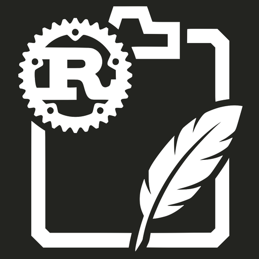

<p align="center">
  
</p>

# clipmem

[](https://crates.io/crates/clipmem)
[](LICENSE)
[](https://www.rust-lang.org)

A searchable, local-only clipboard history for macOS. `clipmem` watches the
system clipboard, archives every observed state into a local SQLite database,
and exposes retrieval commands that return human-readable text or structured
JSON — designed so agents (OpenClaw and others) can recall things you've
copied. It can also run opt-in local OCR for copied images using Apple Vision,
so screenshots and image-only clips become searchable without sending image data
off-device.

<table>
  <tr>
    <td align="center" width="50%">
      <br>
      <sub>Ask OpenClaw what you copied.</sub>
    </td>
    <td align="center" width="50%">
      <br>
      <sub>Browse recent clips from the menu bar.</sub>
    </td>
  </tr>
</table>

## Requirements

- **macOS** — clipboard capture uses `NSPasteboard` via `objc2`
- **Apple Silicon** for the prebuilt Homebrew package
- **Rust 1.88+** for building from source

## Install

Homebrew CLI only (Apple Silicon):

```bash
brew install tristanmanchester/tap/clipmem
clipmem setup
```

Homebrew CLI + menu bar app (Apple Silicon):

```bash
brew install --cask tristanmanchester/tap/clipmem-app
open -a ClipmemMenuBar
```

See [docs/installation.md](docs/installation.md) for Cargo, source builds, upgrades, and Intel Mac support.

## Quick start

```bash
clipmem setup                              # initialize and start background capture
clipmem recall "what was that command?"     # best-first answer
clipmem recent --hours 24                  # recent unique items
clipmem stats --hours 24                   # archive aggregates
clipmem settings ocr on                    # opt in to local image OCR
clipmem ocr run --limit 25                 # backfill OCR for existing images
clipmem doctor                             # check database health
```

See [docs/getting-started.md](docs/getting-started.md) for a full walkthrough.

## Documentation

- [Installation](docs/installation.md) — all install methods, requirements, and upgrades
- [Getting started](docs/getting-started.md) — setup, background capture, and first queries
- [Searching and filtering](docs/searching-and-filtering.md) — recall, search, timeline, OCR text, filters, and pagination
- [Output formats](docs/output-formats.md) — JSON envelope, TOON, exit codes, and script-friendly guarantees
- [Managing your archive](docs/managing-your-archive.md) — restore, delete, export, and capture policy
- [Command reference](docs/command-reference.md) — exhaustive flag-level reference for every command
- [Agent integration](docs/agent-integration.md) — OpenClaw skill installation and agent usage
- [Menu bar app](docs/menu-bar-app.md) — native SwiftUI menu bar frontend
- [Privacy and security](docs/privacy-and-security.md) — local-only guarantees, file permissions, and uninstall
- [Architecture](docs/architecture.md) — capture model, deduplication, search strategy, and limitations
- [Troubleshooting](docs/troubleshooting.md) — diagnose empty results, watcher issues, and database problems
- [Contributing](docs/contributing.md) — project layout, build, test, and release workflow

## License

`clipmem` is released under the MIT License. See [LICENSE](LICENSE).
