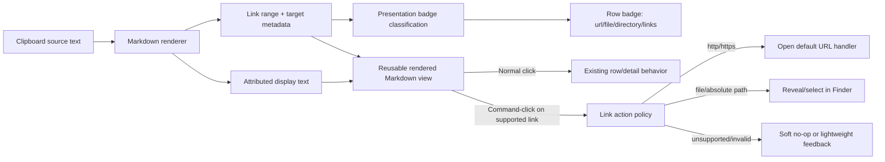

# feat: Command-click Markdown links in menu bar text

## Summary

Extend the menu bar Markdown renderer so visually styled links can be activated with Command-click across the popover, History, and Quick Recall surfaces. Web links should open with the system default handler, file links should reveal/select their target in Finder, and link-heavy rows should use a more descriptive presentation badge such as `url`, `file`, or `directory` without changing stored clipboard content.

---

## Problem Frame

The first Markdown rendering pass intentionally made links visual-only. That keeps navigation safe, but it leaves copied Markdown notes less useful when they contain real web or file references that the user wants to follow from Clipmem.

---

## Requirements

- R1. Markdown links remain visually styled in rendered menu bar text.
- R2. Normal click does not activate Markdown links or change existing row/detail behavior.
- R3. Command-click activates Markdown links everywhere the shared Markdown renderer is used.
- R4. `http://` and `https://` Markdown links open with the system default URL handler.
- R5. `file://` Markdown links and absolute-path Markdown link targets reveal/select the target in Finder.
- R6. File links always reveal/select in Finder rather than opening the file or directory directly.
- R7. `mailto:` and other unsupported schemes are not activated in this pass.
- R8. Missing, invalid, relative, malformed, or unsupported link targets fail softly without a disruptive modal.
- R9. Clipboard storage, restore, copy, search, export, and plain-text source behavior remain unchanged.
- R10. Bare URLs or bare file paths in arbitrary text are not auto-linked unless they are Markdown link targets.
- R11. Result-row kind badges reflect known link target type when existing item metadata or rendered Markdown link metadata is more informative than the stored clipboard kind, using labels such as `url`, `file`, `directory`, or a mixed-link fallback.
- R12. Link-aware badges are presentation-only and do not mutate `SnapshotKind`, persisted metadata, filters, search behavior, or CLI output.

---

## Scope Boundaries

- No normal-click link opening.
- No `mailto:` support.
- No custom app URL schemes beyond `http`, `https`, and file targets.
- No automatic linkification of bare URLs or bare file paths.
- No context menus such as "Copy Link" or "Reveal Link Target".
- No link previews, metadata fetching, or security warning dialogs.
- No persistent reclassification of clipboard item kind based on rendered link contents.
- No Markdown editing, clipboard content rewriting, Rust backend changes, database schema changes, or CLI output changes.

### Deferred to Follow-Up Work

- Add context-menu actions for rendered links if users want copy/reveal/open affordances beyond Command-click.
- Add `mailto:` or broader scheme support if a real workflow justifies launching more external apps from clipboard history.
- Add auto-linking for plain URLs or paths only if Markdown-syntax links are not enough in practice.

---

## Context & Research

### Relevant Code and Patterns

- `macos/ClipmemMenuBar/ClipmemMenuBar/Views/MarkdownTextRenderer.swift` already centralizes display-only Markdown parsing and link styling.
- `macos/ClipmemMenuBar/ClipmemMenuBarTests/MarkdownTextRendererTests.swift` currently asserts that parsed links are styled but non-clickable; those expectations need to evolve.
- `macos/ClipmemMenuBar/ClipmemMenuBar/Views/ResultRowView.swift` is the shared row rendering surface for popover, History result list, and Quick Recall result list.
- `macos/ClipmemMenuBar/ClipmemMenuBar/Views/ResultRowView.swift` currently displays `item.kind.displayTitle` as the visible row badge, which can leave link-heavy text looking like generic `plain_text`.
- `macos/ClipmemMenuBar/ClipmemMenuBar/Views/SnapshotDetailView.swift` renders the History Content section and currently keeps text selection enabled.
- `macos/ClipmemMenuBar/ClipmemMenuBar/Utilities/PasteboardActions.swift` already uses `NSWorkspace.shared.open` for URLs and `NSWorkspace.shared.activateFileViewerSelecting` for file paths.
- `macos/ClipmemMenuBar/ClipmemMenuBar/ViewModels/AppModel.swift` exposes `actionMessage`, and the popover, History, and Quick Recall windows already show `ActionFeedbackOverlay`.
- `macos/ClipmemMenuBar/ClipmemMenuBar/Views/DesignSystem.swift` contains the hover and row styling patterns to preserve.
- `docs/plans/2026-04-28-001-feat-markdown-rendering-plan.md` records the first Markdown pass and explicitly deferred clickable links to a follow-up.

### Institutional Learnings

- `docs/solutions/performance-issues/improve-file-url-capture-storage-performance-2026-04-24.md` emphasizes keeping file URL work scoped and preserving existing file-path behavior. This plan reuses the app's current Finder reveal behavior and avoids capture/storage changes.

### External References

- No external research is needed for this plan. The codebase already has direct URL opening, Finder reveal, SwiftUI/AppKit interop examples, and a shared Markdown renderer to extend.

---

## Key Technical Decisions

- Preserve Command-click as the only activation gesture: this protects existing row selection, text selection, copy, restore, and navigation behavior.
- Split link target resolution from link execution: pure validation and target classification should be unit tested without opening browsers or Finder.
- Reuse existing system actions: web links use the same `NSWorkspace` opening pattern as current URL actions, and file links use the same Finder reveal pattern as current file actions.
- Treat absolute path Markdown targets as file targets: `[label](/tmp/example.txt)` should reveal/select the file, while relative Markdown targets stay non-actionable because Clipmem has no reliable document-relative base URL.
- Keep unsupported links visually styled but inert under Command-click: styling should not imply the scheme is supported by this release.
- Prefer one reusable rendered-link view/component over per-surface gesture handling: all renderer consumers should share the same Command-click semantics.
- Keep view-level behavior thin: hit-testing and gesture handling belong near the rendered text, while URL/file policy and target classification belong in pure helpers.
- Derive row badge overrides from existing item URL/file metadata and rendered link target classification: show `url`, `file`, or `directory` when a dominant target type is clear, and use a mixed-link fallback rather than implying one specific type when multiple target classes are present.

---

## Open Questions

### Resolved During Planning

- Should links open on normal click? No. Use Command-click everywhere.
- Should file links open the file? No. Always reveal/select in Finder.
- Should `mailto:` be supported? No. Leave it out for now.
- Should bare URLs or paths be auto-linked? No. Only Markdown link targets are in scope.
- Should link-heavy rows keep showing `plain_text` when a target type is known? No. The visible badge should prefer useful presentation labels such as `url`, `file`, or `directory`.

### Deferred to Implementation

- Exact SwiftUI/AppKit rendering wrapper shape: choose the smallest component that supports attributed display, link-range hit testing, Command-click detection, and existing row/detail layout constraints.
- Exact hover affordance: add pointing-hand cursor and/or help text if it can be done cleanly without destabilizing row layout.
- Exact non-disruptive feedback for invalid or missing file targets: use existing lightweight action-message behavior where a surface has access to it; otherwise no-op.

---

## High-Level Technical Design

> *This illustrates the intended approach and is directional guidance for review, not implementation specification. The implementing agent should treat it as context, not code to reproduce.*

---

## Implementation Units

- U1. **Separate rendered Markdown output from actionable link targets**

**Goal:** Extend the Markdown rendering layer so it can expose both display-ready attributed text and link target metadata while keeping source strings unchanged.

**Requirements:** R1, R7, R8, R9, R10, R11, R12

**Dependencies:** None

**Files:**
- Modify: `macos/ClipmemMenuBar/ClipmemMenuBar/Views/MarkdownTextRenderer.swift`
- Test: `macos/ClipmemMenuBar/ClipmemMenuBarTests/MarkdownTextRendererTests.swift`

**Approach:**
- Keep the existing rendered visual output for bold, italics, headings, and styled links.
- Add a display model that can carry link ranges, original link targets, and target classification hints alongside the attributed text.
- Stop relying on the SwiftUI `.link` attribute as the activation mechanism; Command-click policy should decide whether a target is actionable.
- Preserve current source-text fallback behavior for malformed Markdown, empty strings, and unsupported constructs.
- Keep unsupported schemes visually styled but classify them as non-actionable.

**Execution note:** Update the existing renderer tests first, because they currently lock in visual-only link behavior and should describe the new display-plus-target contract before view integration begins.

**Patterns to follow:**
- Existing renderer style/fallback behavior in `macos/ClipmemMenuBar/ClipmemMenuBar/Views/MarkdownTextRenderer.swift`.
- Swift Testing assertions in `macos/ClipmemMenuBar/ClipmemMenuBarTests/MarkdownTextRendererTests.swift`.

**Test scenarios:**
- Happy path: `[Clipmem](https://example.com)` renders visible text as `Clipmem`, keeps link-like styling, and exposes one actionable web target for the visible range.
- Happy path: `[local](file:///tmp/example.txt)` renders visible text as `local`, keeps link-like styling, and exposes one file target.
- Happy path: `[local](/tmp/example.txt)` is classified as an absolute-path file target.
- Happy path: link target metadata carries enough target-class information to support a row badge such as `url`, `file`, or `directory`.
- Edge case: `[relative](docs/file.md)` renders visually but is not actionable because the target is relative.
- Edge case: plain text with no Markdown exposes no link targets and preserves visible text.
- Error path: malformed Markdown falls back to readable source text and exposes no link targets.
- Error path: unsupported schemes such as `mailto:` or custom app schemes render visually but are not actionable.

**Verification:**
- Renderer tests prove display text, link styling, target extraction, and fallback behavior without opening external apps.

---

- U2. **Add URL and file-link action policy**

**Goal:** Provide one tested policy for converting supported Markdown link targets into system actions.

**Requirements:** R3, R4, R5, R6, R7, R8, R11, R12

**Dependencies:** U1

**Files:**
- Modify: `macos/ClipmemMenuBar/ClipmemMenuBar/Utilities/PasteboardActions.swift`
- Modify: `macos/ClipmemMenuBar/ClipmemMenuBar.xcodeproj/project.pbxproj`
- Create: `macos/ClipmemMenuBar/ClipmemMenuBarTests/MarkdownLinkActionTests.swift`

**Approach:**
- Add a pure target classification layer that distinguishes web URLs, file URLs, directories, absolute file paths, unsupported schemes, invalid URLs, and relative paths from both Markdown link targets and existing item URL/file metadata.
- Route web targets to the existing URL-opening pattern.
- Route file URL and absolute-path targets to the existing Finder reveal/select pattern.
- Keep execution side effects behind a thin boundary so tests can validate classification without launching apps.
- Treat missing file targets as a soft failure rather than a modal alert.

**Patterns to follow:**
- Existing `openSingleURL` and `revealFilePath` behavior in `macos/ClipmemMenuBar/ClipmemMenuBar/Utilities/PasteboardActions.swift`.
- Existing `ActionFeedbackOverlay` usage in the popover, History, and Quick Recall windows.

**Test scenarios:**
- Happy path: `https://example.com` classifies as a web-open action.
- Happy path: `http://example.com` classifies as a web-open action.
- Happy path: an item with existing `urls` metadata can produce a `url` presentation badge even when the visible text is a bare URL rather than Markdown link syntax.
- Happy path: `file:///tmp/example.txt` classifies as a Finder reveal action.
- Happy path: `/tmp/example.txt` classifies as a Finder reveal action.
- Happy path: an existing directory classifies as a directory presentation badge and a Finder reveal action.
- Edge case: a directory path still routes to Finder reveal/select, not direct open.
- Edge case: a missing file-like path still routes through the soft-failure file reveal path and should not be mislabeled as a confirmed directory.
- Error path: `mailto:test@example.com` classifies as unsupported.
- Error path: an invalid URL string classifies as unsupported or invalid with no launch action.
- Error path: a relative path classifies as non-actionable.

**Verification:**
- Pure policy tests cover all supported and unsupported target categories.
- Side-effecting open/reveal methods remain small and reuse existing `NSWorkspace` patterns.

---

- U3. **Introduce reusable Command-click rendered Markdown view**

**Goal:** Display rendered Markdown while detecting Command-clicks on link ranges and delegating supported link actions.

**Requirements:** R1, R2, R3, R8, R9

**Dependencies:** U1, U2

**Files:**
- Create: `macos/ClipmemMenuBar/ClipmemMenuBar/Views/CommandClickableMarkdownText.swift`
- Modify: `macos/ClipmemMenuBar/ClipmemMenuBar.xcodeproj/project.pbxproj`
- Test: `macos/ClipmemMenuBar/ClipmemMenuBarTests/MarkdownLinkActionTests.swift`

**Approach:**
- Wrap the rendered Markdown output in one reusable view/component instead of adding custom gesture logic to every consumer.
- Preserve the existing visual typography modes for compact rows and detail content.
- Detect Command-click only when the click lands on a supported link target range.
- Preserve normal-click behavior; if the chosen text component cannot pass normal clicks through cleanly, choose a different wrapper strategy rather than weakening R2.
- Keep invalid, missing, or unsupported targets non-disruptive.
- Preserve text selection in detail content if the chosen component can support it without compromising Command-click behavior.

**Patterns to follow:**
- `ScrollElasticityDisabler` and `WindowFrameLimiterView` as examples of small AppKit interop wrappers when SwiftUI alone cannot provide needed macOS behavior.
- Existing row and detail layout constraints from `ResultRowView` and `SnapshotDetailView`.

**Test scenarios:**
- Happy path: Command-click on a supported web link invokes the web-link action boundary.
- Happy path: Command-click on a supported file link invokes the Finder reveal action boundary.
- Edge case: normal click on a link does not invoke the action boundary.
- Edge case: Command-click outside a link range does not invoke the action boundary.
- Edge case: Command-click on an unsupported link range does not invoke the action boundary.
- Integration: compact row rendering remains bounded by the existing line limit and truncation expectations.
- Integration: detail rendering remains readable and keeps existing copy behavior even if text selection needs platform-specific handling.

**Verification:**
- The component can render the same text styles as the current renderer.
- Manual UI verification confirms Command-click activates links and normal click preserves existing behavior.

---

- U4. **Integrate Command-click links across popover, History, and Quick Recall**

**Goal:** Replace current plain `Text` renderer usage with the reusable command-click-capable Markdown view on all shared Markdown surfaces, and make result-row badges describe actionable link target type when that is clearer than the stored kind.

**Requirements:** R1, R2, R3, R4, R5, R6, R8, R9, R11, R12

**Dependencies:** U3

**Files:**
- Modify: `macos/ClipmemMenuBar/ClipmemMenuBar/Views/ResultRowView.swift`
- Modify: `macos/ClipmemMenuBar/ClipmemMenuBar/Views/SnapshotDetailView.swift`
- Test: `macos/ClipmemMenuBar/ClipmemMenuBarTests/MarkdownTextRendererTests.swift`
- Test: `macos/ClipmemMenuBar/ClipmemMenuBarTests/MarkdownLinkActionTests.swift`

**Approach:**
- Use the new rendered Markdown view in `ResultRowView` so popover, History result rows, and Quick Recall rows inherit the same Command-click behavior.
- Use the same view in History detail content, configured for detail typography and multiline layout.
- Preserve existing row metadata, highlighting, scoring, hover help, action buttons, copy button behavior, and source text.
- Override the visible row badge only when link classification gives a clearer presentation label than the stored kind.
- Prefer `url` for web targets from either rendered links or existing `urls` metadata, `directory` for confirmed directory targets, `file` for file-like targets from rendered links or existing `filePaths` metadata, and a mixed-link fallback when multiple target classes are present.
- Avoid changing `ClipmemItem`, `SnapshotDetails`, CLI decoding, or backend capture behavior.
- Surface lightweight feedback for failed file reveal only where the existing view context can do so cleanly.

**Patterns to follow:**
- Shared row usage through `ResultRowView`.
- Existing `bestText(from:)` and copy button behavior in `SnapshotDetailView`.
- Existing `ActionFeedbackOverlay` behavior in app windows.

**Test scenarios:**
- Happy path: a row containing a Markdown web link opens only on Command-click and leaves normal row click behavior intact.
- Happy path: a row containing a Markdown web link shows a `url` presentation badge instead of generic `plain_text`.
- Happy path: a row whose existing item metadata contains a URL shows a `url` presentation badge even if the visible text is a bare URL.
- Happy path: a row containing a Markdown link to an existing directory shows a `directory` presentation badge.
- Happy path: a row containing a Markdown file target shows a `file` presentation badge.
- Edge case: a row containing mixed actionable link target classes uses a mixed-link fallback badge instead of picking a misleading single class.
- Happy path: a detail content link reveals a file in Finder on Command-click.
- Edge case: a row with no links behaves the same as before.
- Edge case: a malformed Markdown row still displays readable source text.
- Error path: a missing file target fails softly without blocking the user.
- Integration: popover, History results, and Quick Recall share the updated `ResultRowView` behavior.

**Verification:**
- Manual UI verification covers popover rows, History rows, Quick Recall rows, and History detail content.
- Copy/restore/export behavior uses original clipboard source text after the integration.

---

- U5. **Update documentation and release notes**

**Goal:** Document the user-facing link activation behavior and the intentionally unsupported cases.

**Requirements:** R2, R3, R4, R5, R6, R7, R10, R11, R12

**Dependencies:** U4

**Files:**
- Modify: `CHANGELOG.md`
- Modify: `docs/menu-bar-app.md`

**Approach:**
- Update release notes to say rendered Markdown links can be Command-clicked.
- Document that web links open normally, file links reveal/select in Finder, link-bearing rows can show more specific badges, and unsupported schemes such as `mailto:` are not active in this pass.
- Keep docs focused on user-visible behavior, not implementation internals.

**Patterns to follow:**
- Existing `CHANGELOG.md` Unreleased style.
- Existing menu bar documentation tone in `docs/menu-bar-app.md`.

**Test scenarios:**
- Test expectation: none -- documentation-only unit.

**Verification:**
- Documentation matches the implemented interaction model and does not imply normal-click activation.

---

## System-Wide Impact

- **Interaction graph:** Rendered Markdown display changes affect `ResultRowView` consumers and History detail content. Badge selection changes are row presentation-only. Existing restore, copy, export, search, filter, and metadata paths should remain unchanged.
- **Error propagation:** Invalid, unsupported, or missing link targets should not throw user-blocking errors. When feedback is available, use lightweight action-message behavior.
- **State lifecycle risks:** No persistent state changes are introduced. Link activation is an immediate UI action only.
- **API surface parity:** No CLI, Rust library, database, JSON contract, or capture API changes are planned.
- **Integration coverage:** Manual UI verification is required because Command-click hit-testing and Finder/browser launch boundaries are view-level macOS behavior.
- **Unchanged invariants:** Clipboard text remains source-of-truth for copy, restore, search, export, and hover help. Rendering and link activation are presentation-layer behavior only.

---

## Risks & Dependencies

| Risk | Mitigation |
|------|------------|
| SwiftUI `Text` may not provide enough hit-testing control for Command-click links. | Plan for a reusable SwiftUI/AppKit wrapper if needed, keeping AppKit interop isolated to one component. |
| Normal click behavior could be swallowed by the clickable text component. | Require tests/manual verification that normal click does not open links and that rows remain selectable/restorable. |
| File paths may be stale or missing by the time the user activates them. | Treat missing targets as a soft failure and avoid modal alerts. |
| Detail text selection may conflict with custom link hit-testing. | Preserve copy button behavior unconditionally and keep text selection if the selected platform component supports it cleanly. |
| Unsupported schemes may look clickable because links are visually styled. | Command-click unsupported targets should no-op or show lightweight feedback; docs should state supported schemes. |
| Presentation badges could imply that the stored clipboard kind changed. | Keep badge override logic UI-local and document that copy/search/export/filter semantics still use original item data. |

---

## Documentation / Operational Notes

- Update `docs/menu-bar-app.md` to describe Command-click link activation, Finder reveal behavior, and link-aware row badges.
- Update `CHANGELOG.md` under `Unreleased` when implementation lands.
- No rollout, migration, or service restart work is required beyond rebuilding the menu bar app.

---

## Sources & References

- Related plan: [docs/plans/2026-04-28-001-feat-markdown-rendering-plan.md](docs/plans/2026-04-28-001-feat-markdown-rendering-plan.md)
- Related code: `macos/ClipmemMenuBar/ClipmemMenuBar/Views/MarkdownTextRenderer.swift`
- Related code: `macos/ClipmemMenuBar/ClipmemMenuBar/Views/ResultRowView.swift`
- Related code: `macos/ClipmemMenuBar/ClipmemMenuBar/Views/SnapshotDetailView.swift`
- Related code: `macos/ClipmemMenuBar/ClipmemMenuBar/Utilities/PasteboardActions.swift`
- Related tests: `macos/ClipmemMenuBar/ClipmemMenuBarTests/MarkdownTextRendererTests.swift`
