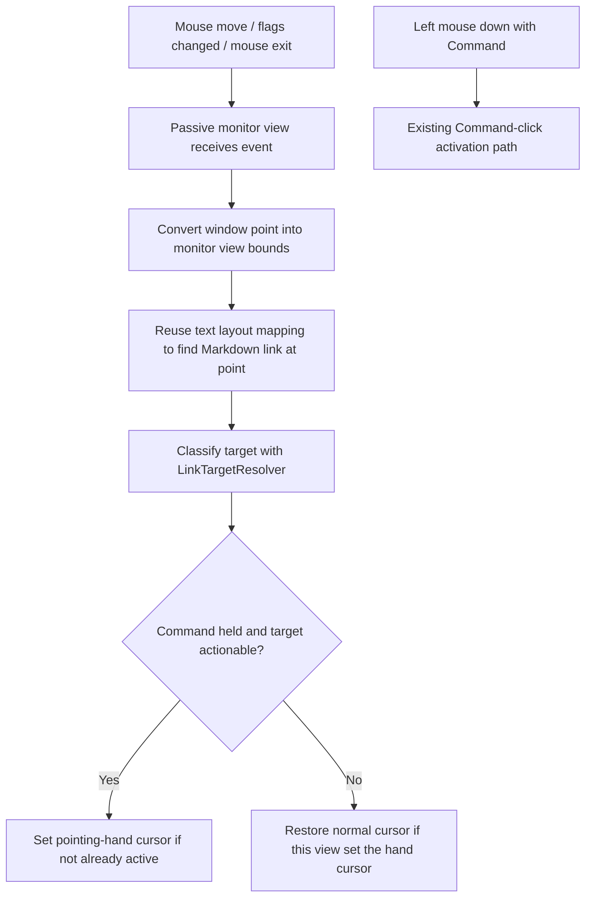

# feat: Show Command-Link Hover Cursor

## Summary

Add a macOS pointing-hand cursor affordance for rendered Markdown links only while the Command key is held. The implementation should extend the existing passive AppKit event-monitor bridge so SwiftUI `Text` remains the renderer and the link overlay still does not participate in hit testing.

---

## Problem Frame

Command-click links now work in the popover and history surfaces, but the pointer does not communicate that a rendered Markdown link is actionable. A static hand cursor would overstate clickability because the links are intentionally Command-click-only, so the cursor should change only when the modifier key makes the link actionable.

---

## Requirements

- R1. When the pointer is over an actionable rendered Markdown link and the Command key is held, show the macOS pointing-hand cursor.
- R2. When Command is released, the pointer leaves the link, the pointer leaves the text area, or the link target is unsupported, restore the normal cursor behavior.
- R3. Preserve the existing SwiftUI Markdown rendering appearance and text selection behavior; do not replace `Text(rendered.attributed)` with an AppKit text view.
- R4. Preserve the crash-safe passive event model used for Command-click activation; cursor handling must not make the link bridge participate in SwiftUI/AppKit hit testing.
- R5. Keep hover/click target detection consistent with Command-click activation by reusing the same link classification and text-position mapping rules.

---

## Scope Boundaries

- Do not make links clickable without Command.
- Do not add visual underline/color changes on hover; this plan only changes the mouse cursor.
- Do not support unsupported targets such as relative paths or `mailto:` links.
- Do not rewrite Markdown rendering, row layout, or the popover button structure.
- Do not introduce global event monitoring or accessibility-permission-dependent behavior.

---

## Context & Research

### Relevant Code and Patterns

- `macos/ClipmemMenuBar/ClipmemMenuBar/Views/CommandClickableMarkdownText.swift` already contains the smallest AppKit bridge: SwiftUI owns rendering, while `LinkCommandClickMonitor` observes local left mouse-down events and maps click points to rendered Markdown link ranges.
- `macos/ClipmemMenuBar/ClipmemMenuBar/Utilities/PasteboardActions.swift` owns link classification through `LinkTargetResolver.classify`, including the actionable/unsupported distinction that cursor handling should reuse.
- `macos/ClipmemMenuBar/ClipmemMenuBar/Views/MenuBarPanelView.swift` previously needed careful `contentShape` placement to avoid SwiftUI/AppKit hit-test recursion, so the cursor implementation should remain passive.

### Institutional Learnings

- No directly relevant `docs/solutions/` entry exists for cursor handling, tracking areas, or Markdown links.

### External References

- Apple’s Cocoa Event Handling Guide documents that local event monitors observe events dispatched within the current application, can return the original event or `nil`, and should be removed before the end of the owning object’s lifecycle: [Monitoring Events](https://developer.apple.com/library/archive/documentation/Cocoa/Conceptual/EventOverview/MonitoringEvents/MonitoringEvents.html).
- Apple’s Human Interface Guidelines identify the pointing-hand cursor as the macOS pointer style for URL/document/item link targets: [Pointing devices](https://developer.apple.com/design/human-interface-guidelines/pointing-devices).
- Apple’s `NSCursor`, `NSTrackingArea`, and `NSEvent.addLocalMonitorForEvents(matching:handler:)` docs confirm the relevant AppKit APIs, though the web pages require JavaScript for full rendering.

---

## Key Technical Decisions

- Extend the existing passive `LinkCommandClickMonitor` instead of adding a new overlay or replacing SwiftUI `Text`: this preserves the crash fix and avoids returning an AppKit view from `hitTest`.
- Use local AppKit event observation plus a tracking area, not global monitoring: the cursor only matters while the pointer is inside this app’s popover/history window, and global monitors would add unnecessary scope and privacy concerns.
- Treat cursor state as derived UI state inside `LinkCommandClickMonitorView`/`Coordinator`: SwiftUI should continue to own the text content, while AppKit owns pointer-specific state.
- Reuse link classification for hover eligibility: cursor changes should happen only for targets that Command-click would open/reveal.
- Prefer setting/restoring the cursor only on state transitions: repeated `NSCursor.set()` calls during every mouse movement can be noisy and may fight AppKit cursor rect updates.

---

## Open Questions

### Resolved During Planning

- Should the hand cursor appear all the time over Markdown links? No. Because activation requires Command-click, the hand cursor should appear only while Command is currently held.
- Should this use a global event monitor? No. Local monitoring and tracking areas are enough for an in-app popover/history hover affordance.
- Should cursor support require a new AppKit text renderer? No. The prior AppKit text-rendering attempt regressed size/Markdown appearance, so cursor handling must keep SwiftUI `Text`.

### Deferred to Implementation

- Whether the best cursor reset trigger is `mouseExited`, `viewWillMove(toWindow:)`, local `.flagsChanged`, or a small combination: implementation can choose the minimal set that behaves correctly under the popover lifecycle.
- Whether AppKit cursor rects interfere with direct cursor setting in this view hierarchy: implementation should verify manually in the running popover and adjust if AppKit immediately resets the cursor.

---

## High-Level Technical Design

> *This illustrates the intended approach and is directional guidance for review, not implementation specification. The implementing agent should treat it as context, not code to reproduce.*

---

## Implementation Units

- U1. **Track Command-hover link state**

**Goal:** Extend the passive AppKit bridge so it can evaluate whether the current mouse location is over an actionable link while Command is held.

**Requirements:** R1, R2, R4, R5

**Dependencies:** None

**Files:**
- Modify: `macos/ClipmemMenuBar/ClipmemMenuBar/Views/CommandClickableMarkdownText.swift`
- Test: `macos/ClipmemMenuBar/ClipmemMenuBarTests/MarkdownLinkActionTests.swift`

**Approach:**
- Add tracking-area support to `LinkCommandClickMonitorView` for mouse movement and exit events while the view is visible.
- Expand the local monitor’s event mask to include modifier changes that affect Command state.
- Keep `hitTest(_:) -> nil` unchanged so the monitor never becomes the clicked view.
- Give the coordinator a reusable "link at point" query for both click handling and hover eligibility. The query should still classify the link target before treating it as actionable.
- Track enough current state to update on both mouse movement and Command-key transitions. If the user holds Command while already hovering a link, the cursor should change without requiring an extra mouse move.

**Patterns to follow:**
- Existing passive monitor setup and cleanup in `CommandClickableMarkdownText.swift`.
- Existing link target classification in `PasteboardActions.swift`.
- Existing Markdown link tests in `MarkdownLinkActionTests.swift`.

**Test scenarios:**
- Happy path: Given an `https` Markdown link and a point inside its rendered link range, hover eligibility reports actionable when Command is held.
- Happy path: Given a `file://` or absolute path Markdown link and a point inside its rendered link range, hover eligibility reports actionable when Command is held.
- Edge case: Given the same actionable link and point, hover eligibility reports inactive when Command is not held.
- Edge case: Given a point outside all link ranges, hover eligibility reports inactive even when Command is held.
- Error path: Given an unsupported target such as `mailto:` or a relative path, hover eligibility reports inactive even when Command is held.

**Verification:**
- The link monitor still does not participate in hit testing.
- Existing Command-click behavior still routes through the current activation path.
- Unit-level target eligibility agrees with existing link action classification.

---

- U2. **Apply and restore the pointing-hand cursor**

**Goal:** Show `NSCursor.pointingHand` only while Command-hover is active, and restore normal cursor behavior when it is not.

**Requirements:** R1, R2, R4

**Dependencies:** U1

**Files:**
- Modify: `macos/ClipmemMenuBar/ClipmemMenuBar/Views/CommandClickableMarkdownText.swift`

**Approach:**
- Keep a small cursor ownership flag in `LinkCommandClickMonitorView` or the coordinator so this bridge only restores the cursor when it previously set it.
- Set the pointing-hand cursor on transition from inactive to active.
- Restore the arrow/default cursor on transition from active to inactive, mouse exit, window removal, or monitor teardown.
- Avoid broad cursor resets during ordinary row movement; only update when the computed state changes.
- Preserve `selectionEnabled` behavior in history detail text. The cursor affordance should not interfere with text selection when Command is not held.

**Patterns to follow:**
- AppKit interop guardrail: keep imperative pointer behavior inside the representable/coordinator.
- Apple event-monitor guidance: remove local monitors when the owning view leaves its window.

**Test scenarios:**
- Test expectation: none at unit-test level -- direct cursor shape changes require AppKit runtime verification and are not meaningfully observable in existing Swift unit tests.

**Verification:**
- In the popover, moving over a rendered web link while holding Command changes to the pointing-hand cursor.
- Releasing Command while still over the link restores the normal cursor.
- Moving off the link or out of the row restores the normal cursor.
- Unsupported links do not show the hand cursor.

---

- U3. **Verify popover and history interaction behavior**

**Goal:** Confirm the cursor affordance works on both surfaces without regressing rendering, selection, or Command-click activation.

**Requirements:** R1, R2, R3, R4, R5

**Dependencies:** U1, U2

**Files:**
- Modify: `CHANGELOG.md`
- Test: `macos/ClipmemMenuBar/ClipmemMenuBarTests/MarkdownLinkActionTests.swift`
- Test: `macos/ClipmemMenuBar/ClipmemMenuBarTests/MarkdownTextRendererTests.swift`

**Approach:**
- Add a user-facing changelog note under `Unreleased` because this changes the menu bar app interaction affordance.
- Keep existing renderer tests intact so the cursor work does not imply a rendering rewrite.
- Manually verify in the dev app because cursor shape and popover hit-testing are UI/runtime behaviors not covered by current unit tests.

**Patterns to follow:**
- Existing changelog discipline in `CHANGELOG.md`.
- Existing macOS menu bar test coverage style in `MarkdownTextRendererTests.swift` and `MarkdownLinkActionTests.swift`.

**Test scenarios:**
- Integration: In the recent-items popover, Command-hovering an actionable URL link shows the hand cursor and Command-clicking it opens the URL without crashing.
- Integration: In the recent-items popover, Command-hovering a file or directory link shows the hand cursor and Command-clicking it reveals/selects it in Finder without crashing.
- Integration: In the history detail view, ordinary text selection still works when Command is not held.
- Edge case: Releasing Command while the pointer is over a link restores the normal cursor without requiring mouse movement.
- Edge case: Closing the popover while the hand cursor is active restores normal cursor behavior.

**Verification:**
- Existing unit tests pass.
- Manual popover and history checks confirm cursor state, Command-click behavior, and Markdown rendering appearance.

---

## System-Wide Impact

- **Interaction graph:** The change stays inside the Markdown text bridge and affects popover rows plus history detail text that already use `CommandClickableMarkdownText`.
- **Error propagation:** Link target failures remain classified as unsupported or handled by existing `PasteboardActions.openLinkTarget`; cursor logic should not introduce user-visible errors.
- **State lifecycle risks:** Cursor ownership and monitor cleanup are the main lifecycle risks. The implementation must reset cursor state when the view leaves its window.
- **API surface parity:** No CLI, database, or public API changes.
- **Integration coverage:** Manual UI verification is required because cursor state, popover lifecycle, and AppKit event routing are not proven by unit tests.
- **Unchanged invariants:** Markdown rendering remains SwiftUI `Text`; Command-click remains the only activation gesture; unsupported links remain visually styled but non-actionable.

---

## Risks & Dependencies

| Risk | Mitigation |
|------|------------|
| Cursor updates reintroduce SwiftUI/AppKit hit-test recursion | Keep `hitTest(_:) -> nil`, use passive tracking/event monitoring only, and avoid gesture recognizers or clickable overlays. |
| Cursor gets stuck as a hand after the popover closes | Track whether this bridge set the hand cursor and reset on mouse exit, inactive state, monitor removal, and window detachment. |
| Cursor state disagrees with click behavior | Use the same link-at-point mapping and `LinkTargetResolver.classify` path for hover eligibility and click activation. |
| AppKit resets cursor rects after direct `NSCursor.set()` | Verify manually and, if needed during implementation, adjust to tracking-area-driven updates without changing the passive hit-test model. |

---

## Documentation / Operational Notes

- Update `CHANGELOG.md` under `Unreleased` with a short user-facing note about Command-hover link cursor feedback.
- No user documentation changes are required unless `docs/menu-bar-app.md` already mentions Command-click link behavior and would benefit from a one-line cursor note.

---

## Sources & References

- Related code: `macos/ClipmemMenuBar/ClipmemMenuBar/Views/CommandClickableMarkdownText.swift`
- Related code: `macos/ClipmemMenuBar/ClipmemMenuBar/Utilities/PasteboardActions.swift`
- Related tests: `macos/ClipmemMenuBar/ClipmemMenuBarTests/MarkdownLinkActionTests.swift`
- Related tests: `macos/ClipmemMenuBar/ClipmemMenuBarTests/MarkdownTextRendererTests.swift`
- External docs: [Apple Cocoa Event Handling Guide: Monitoring Events](https://developer.apple.com/library/archive/documentation/Cocoa/Conceptual/EventOverview/MonitoringEvents/MonitoringEvents.html)
- External docs: [Apple Human Interface Guidelines: Pointing devices](https://developer.apple.com/design/human-interface-guidelines/pointing-devices)
- External docs: [Apple Developer Documentation: NSCursor](https://developer.apple.com/documentation/appkit/nscursor)
- External docs: [Apple Developer Documentation: NSEvent.addLocalMonitorForEvents](https://developer.apple.com/documentation/appkit/nsevent/addlocalmonitorforevents%28matching%3Ahandler:%29)
- External docs: [Apple Developer Documentation: NSTrackingArea mouseMoved option](https://developer.apple.com/documentation/appkit/nstrackingarea/options-swift.struct/mousemoved)
